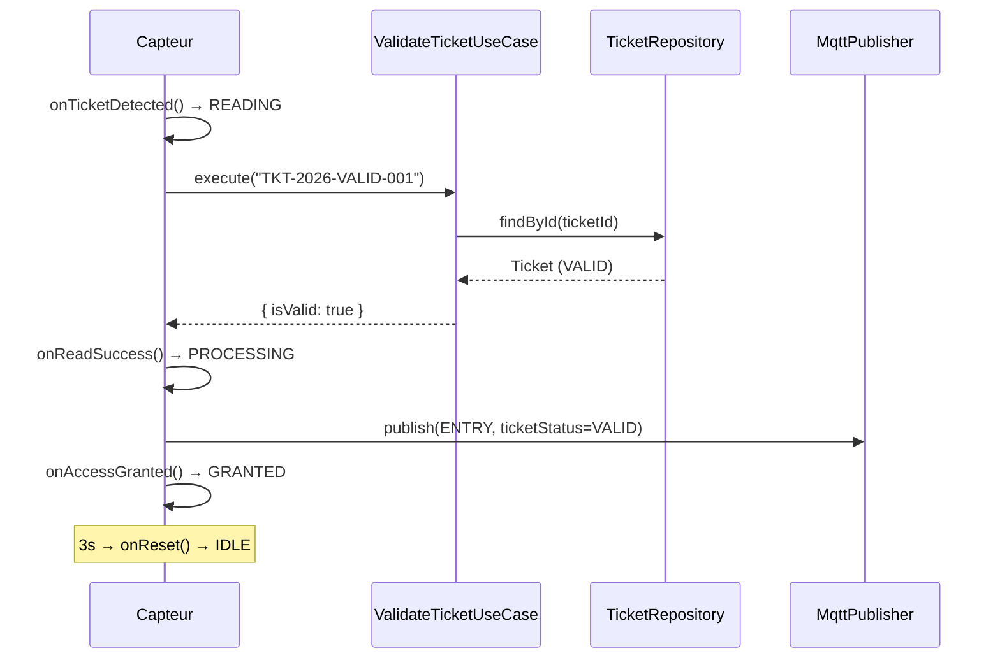
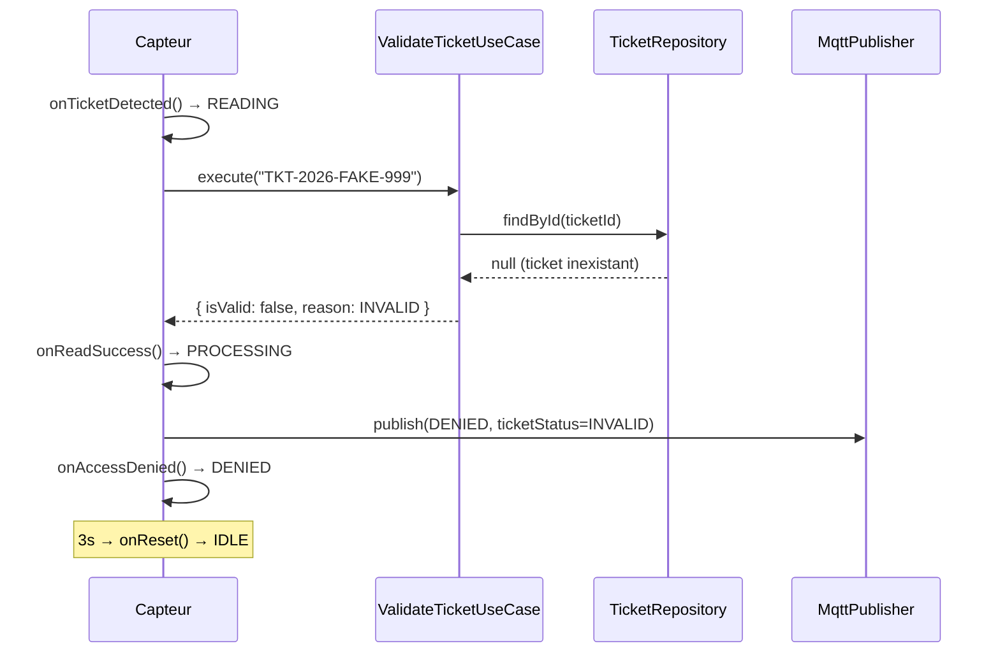
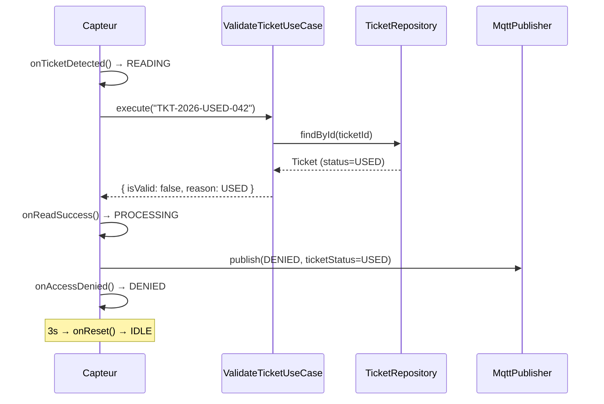
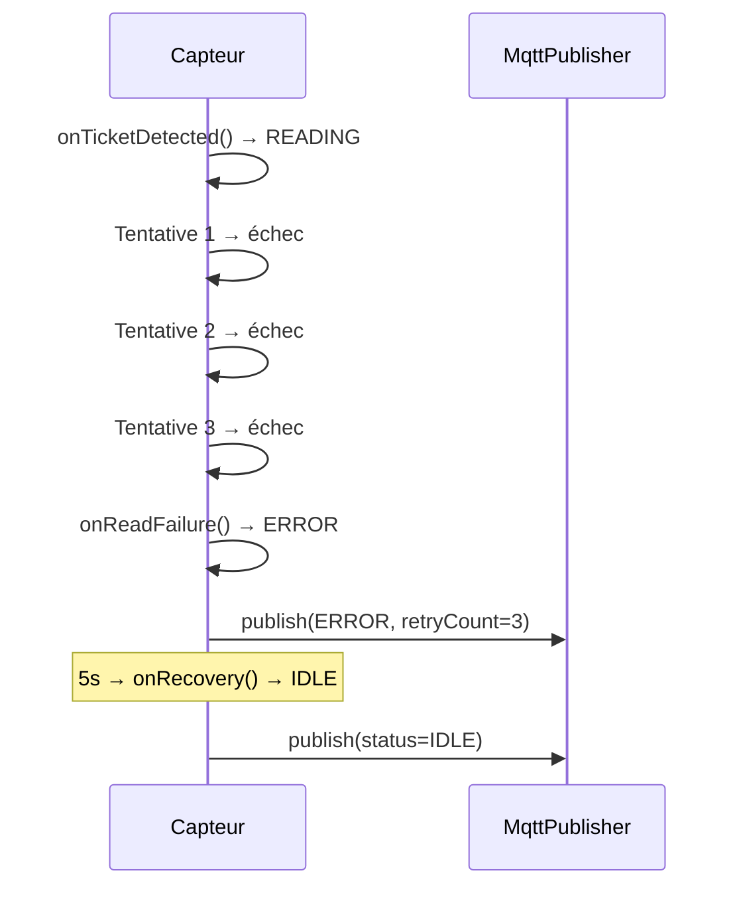
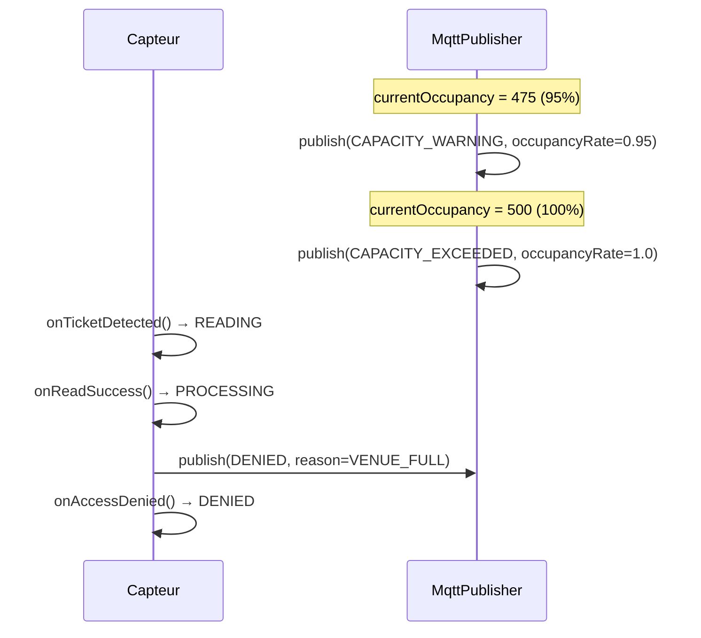
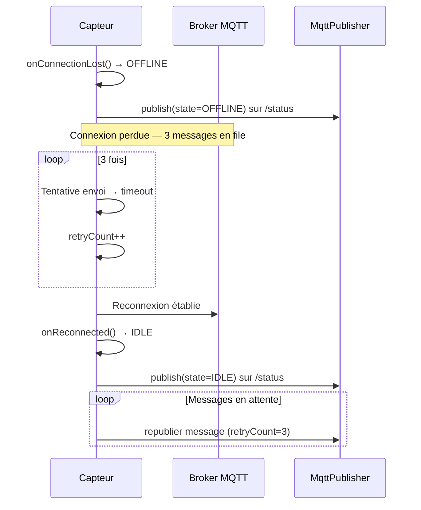

# Scénarios de simulation

## Scénario 1 — Entrée valide

**Description** : Un visiteur présente le billet `TKT-2026-VALID-001`, valide et non utilisé. L'appareil passe par les états READING → PROCESSING → GRANTED, enregistre l'entrée et incrémente l'occupance.

**Messages attendus** :
- Topic `festival/venue/venue-grand-palais/access`
- `eventType: "ENTRY"`, `ticketStatus: "VALID"`, `state: "GRANTED"`
- `currentOccupancy: +1`

---

## Scénario 2 — Billet invalide

**Description** : Un visiteur présente le billet `TKT-2026-FAKE-999` qui n'existe pas en base. L'accès est refusé immédiatement.

**Messages attendus** :
- `eventType: "DENIED"`, `ticketStatus: "INVALID"`, `state: "DENIED"`
- `currentOccupancy: inchangé`

---

## Scénario 3 — Billet déjà utilisé

**Description** : Le billet `TKT-2026-USED-042` a déjà été scanné. Le système détecte le statut `USED` et refuse l'entrée.

**Messages attendus** :
- `eventType: "DENIED"`, `ticketStatus: "USED"`, `state: "DENIED"`

---

## Scénario 4 — Erreur de lecture

**Description** : Le capteur tente de lire un ticket 3 fois et échoue à chaque fois (QR code illisible, bruit RFID). L'appareil passe en état ERROR, puis récupère automatiquement après 5 secondes.

**Messages attendus** :
- Topic `festival/device/GATE-EXPO-A1-001/error`
- `eventType: "ERROR"`, `state: "ERROR"`, `metadata.retryCount: 3`

---

## Scénario 5 — Dépassement de jauge

**Description** : L'occupance atteint 95% de la capacité (475/500), déclenchant un avertissement. Puis elle atteint 100% (500/500) et tout accès est refusé avec la raison `VENUE_FULL`.

**Messages attendus** :
- Topic `festival/venue/venue-grand-palais/capacity`
- `eventType: "CAPACITY_WARNING"`, `occupancyRate: 0.95`
- `eventType: "CAPACITY_EXCEEDED"`, `occupancyRate: 1.0`
- Topic `festival/venue/venue-grand-palais/access`
- `eventType: "DENIED"` (billet valide mais lieu plein)

---

## Scénario 6 — Perte de message et retour stable

**Description** : Le dispositif perd sa connexion MQTT. 3 messages sont perdus pendant l'interruption. À la reconnexion, le device passe OFFLINE → IDLE et republié les messages en attente.

**Messages attendus** :
- Topic `festival/device/GATE-EXPO-A1-001/status`
- `state: "OFFLINE"` puis `state: "IDLE"`
- Messages en attente republiés sur `festival/venue/venue-grand-palais/access`
- `metadata.retryCount: 3`
