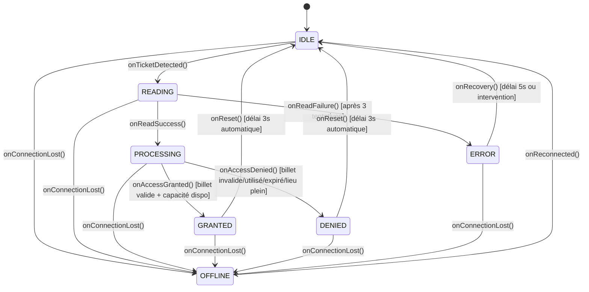

# Machine à états du dispositif IoT

## Diagramme

## Description des états

| État | Description | Couleur dashboard |
|---|---|---|
| `IDLE` | En attente d'un billet — état stable par défaut | Bleu |
| `READING` | Lecture du QR code / RFID en cours | Violet |
| `PROCESSING` | Validation du billet en cours | Orange |
| `GRANTED` | Accès accordé — porte ouverte | Vert |
| `DENIED` | Accès refusé — porte bloquée | Rouge |
| `ERROR` | Erreur de lecture après 3 tentatives | Rouge foncé |
| `OFFLINE` | Perte de connexion MQTT | Gris |

## Transitions

| De | Vers | Déclencheur | Condition |
|---|---|---|---|
| `IDLE` | `READING` | `onTicketDetected()` | Ticket détecté par le capteur |
| `READING` | `PROCESSING` | `onReadSuccess()` | Lecture réussie |
| `READING` | `ERROR` | `onReadFailure()` | 3 tentatives de lecture échouées |
| `PROCESSING` | `GRANTED` | `onAccessGranted()` | Billet valide ET capacité disponible |
| `PROCESSING` | `DENIED` | `onAccessDenied()` | Billet invalide/utilisé/expiré OU lieu plein |
| `GRANTED` | `IDLE` | `onReset()` | Automatique après 3 secondes |
| `DENIED` | `IDLE` | `onReset()` | Automatique après 3 secondes |
| `ERROR` | `IDLE` | `onRecovery()` | Automatique après 5 secondes |
| Tout état | `OFFLINE` | `onConnectionLost()` | Perte de connexion MQTT |
| `OFFLINE` | `IDLE` | `onReconnected()` | Reconnexion MQTT établie |

## Actions associées aux transitions

| Transition | Message MQTT publié | Topic |
|---|---|---|
| `PROCESSING → GRANTED` | `eventType: "ENTRY"` | `festival/venue/{id}/access` |
| `PROCESSING → DENIED` | `eventType: "DENIED"` | `festival/venue/{id}/access` |
| `READING → ERROR` | `eventType: "ERROR"`, `retryCount: 3` | `festival/device/{id}/error` |
| Jauge > 95% | `eventType: "CAPACITY_WARNING"` | `festival/venue/{id}/capacity` |
| Jauge = 100% | `eventType: "CAPACITY_EXCEEDED"` | `festival/venue/{id}/capacity` |
| `→ OFFLINE` | `state: "OFFLINE"` | `festival/device/{id}/status` |
| `OFFLINE → IDLE` | `state: "IDLE"` | `festival/device/{id}/status` |
